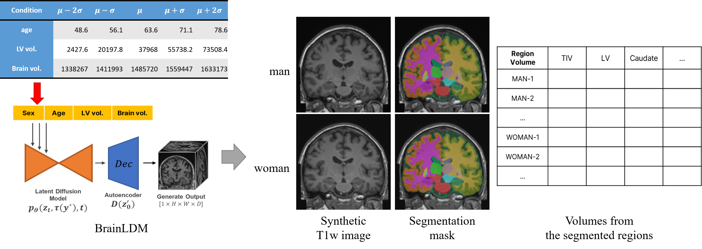
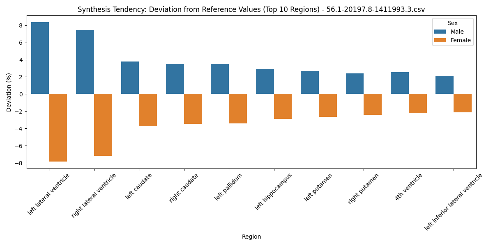

# GenAI_sexDiff

## Anaylsis pipeline 


## Visualization of synthetic tendency from generative model.



## 1. installation

### a. environment setup
```
conda create -n vcm python=3.12 -y
conda activate vcm
sh setup.sh
```
*you may need to install jupyter extensions for running `Sampling+Anaylsis.ipynb`.

## 2. download weights

By using `models/large_files.yml`, download the weights for BrainLDM (53M for `autoencoder.pth` and 2.1G for `diffusion_model.path`) and VCM (173M).

locate them in the `models` directory